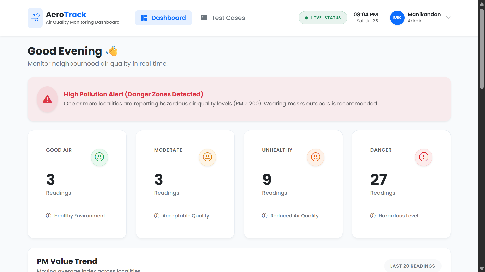
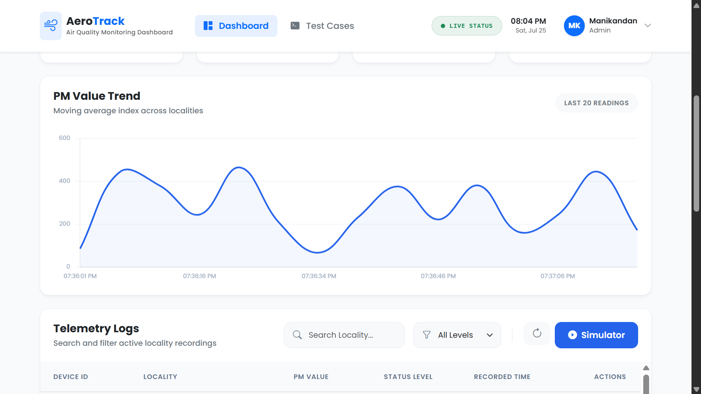
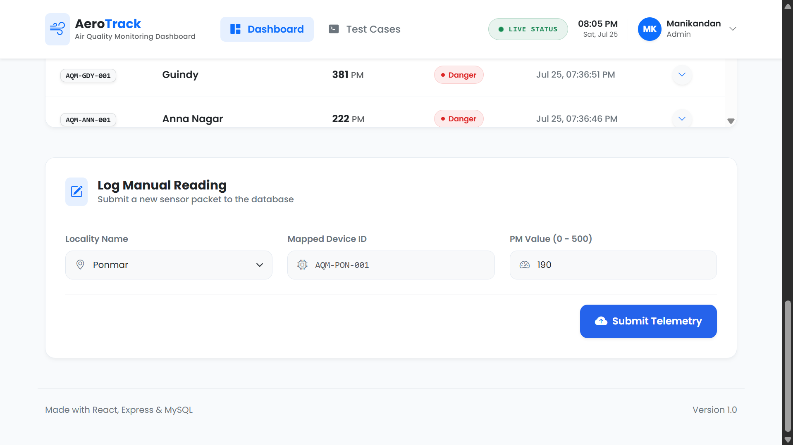
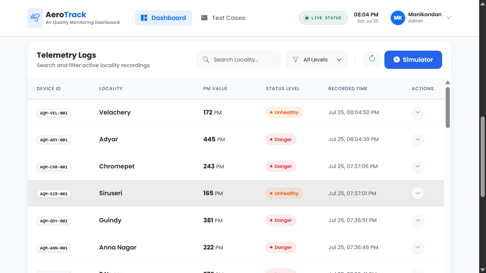
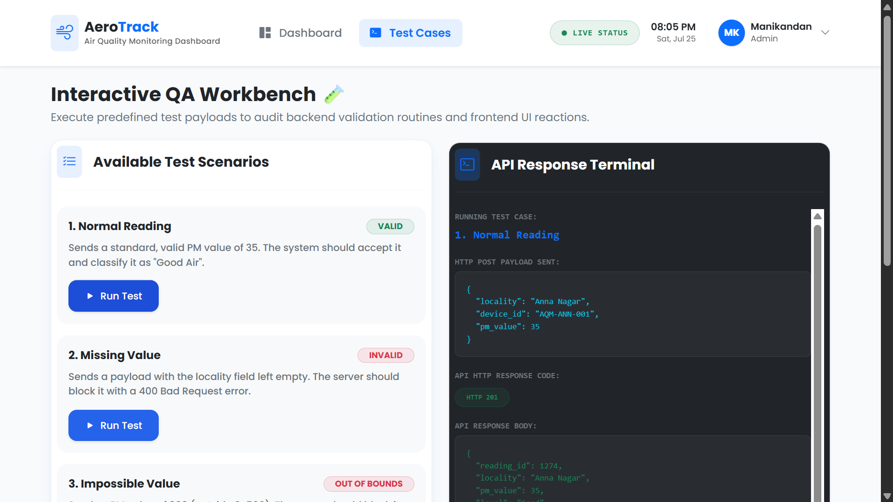

# 🌍 AeroTrack - Air Quality Monitoring Dashboard

AeroTrack is a full-stack Air Quality Monitoring Dashboard developed using **React, Node.js, Express.js, and MySQL**. The application simulates air quality sensor readings, stores them in a MySQL database, and displays the data through a modern, responsive dashboard.

The project demonstrates full-stack web development concepts including REST APIs, database integration, data visualization, and real-time simulation using a simple, beginner-friendly architecture.

---

## 📌 Features

- 📊 Responsive dashboard with air quality statistics
- 🌿 Automatic air quality level classification
- 📈 PM value trend visualization using Chart.js
- 🔄 Background simulator that generates readings every 5 seconds
- ➕ Add new air quality readings manually
- 🔍 Search readings by locality
- 🎯 Filter readings by air quality level
- 📱 Fully responsive Bootstrap 5 interface
- ⚠️ Input validation and error handling
- 🧪 Built-in test cases for validation scenarios
- 💾 MySQL database integration

---

# 🛠️ Tech Stack

## Frontend

- React.js
- Bootstrap 5
- Bootstrap Icons
- Axios
- Chart.js
- Vite

## Backend

- Node.js
- Express.js

## Database

- MySQL

## Development Tools

- Nodemon
- Git
- GitHub

---

# 📂 Project Structure

```
AeroTrack/
│
├── backend/
│   ├── config/
│   │   └── db.js
│   │
│   ├── controllers/
│   │   └── readingController.js
│   │
│   ├── models/
│   │   └── Reading.js
│   │
│   ├── routes/
│   │   └── readingRoutes.js
│   │
│   ├── schema.sql
│   ├── server.js
│   ├── .env.example
│   └── package.json
│
├── frontend/
│   ├── src/
│   │   ├── components/
│   │   ├── App.jsx
│   │   ├── main.jsx
│   │   └── index.css
│   │
│   ├── index.html
│   ├── vite.config.js
│   └── package.json
│
└── README.md
```

---

# ⚙️ How the Project Works

### 1. Background Simulator

The backend automatically generates a new air quality reading every **5 seconds**.

Each generated reading:

- Produces a random PM value
- Rejects impossible values
- Applies a simple moving average to smooth fluctuations
- Calculates the air quality level
- Stores the reading in MySQL

---

### 2. Dashboard

When the dashboard loads, the frontend retrieves data from the backend using REST APIs.

The dashboard displays:

- Total readings
- Air quality statistics
- PM trend chart
- Recent readings
- Search and filter options

---

### 3. Manual Reading

Users can manually add a new reading by entering:

- Locality
- Device ID
- PM Value

The backend validates the data before saving it.

---

### 4. Test Cases

The application includes built-in test cases to demonstrate handling of:

- Normal readings
- Missing values
- Impossible values
- Stuck sensor readings
- Extreme pollution values

---

# 🗄️ Database Setup

## Create Database

```sql
CREATE DATABASE air_quality_db;
USE air_quality_db;
```

Run the SQL script located at:

```
backend/schema.sql
```

This will create the required tables and insert sample data.

---

# 🔧 Environment Variables

Create a `.env` file inside the backend folder.

```env
PORT=5000

DB_HOST=localhost
DB_USER=root
DB_PASSWORD=your_mysql_password
DB_NAME=air_quality_db
```

---

# ▶️ Installation

## Clone Repository

```bash
git clone https://github.com/your-username/aerotrack-air-quality-dashboard.git
```

---

## Backend Setup

```bash
cd backend

npm install

npm run dev
```

---

## Frontend Setup

```bash
cd frontend

npm install

npm run dev
```

---

Open

```
http://localhost:3000
```

---

# 📡 API Endpoints

| Method | Endpoint | Description |
|---------|----------|-------------|
| GET | `/` | API status |
| GET | `/simulate` | Starts/checks simulator |
| GET | `/api/readings` | Retrieve all readings |
| GET | `/api/readings/stats` | Dashboard statistics |
| GET | `/api/readings/trend` | Latest PM trend |
| POST | `/api/readings` | Add new reading |

---

# 📊 Air Quality Levels

| PM Value | Level |
|-----------|--------|
| 0 - 50 | 🟢 Good |
| 51 - 100 | 🟡 Moderate |
| 101 - 150 | 🟠 Unhealthy |
| Above 150 | 🔴 Danger |

---
## 🎥 Project Demo

Watch the complete project demonstration on YouTube:

▶️ **[AeroTrack - Air Quality Monitoring Dashboard Demo](https://youtu.be/cubU77PMZHI)**

This demo showcases:
- Dashboard overview
- Air quality statistics
- PM2.5 trend chart
- Manual reading entry
- Search and filtering
- Sensor simulation
- Testing and validation features
---
## 📸 Application Preview

| Dashboard | Air Quality Trend |
|-----------|-------------------|
|  |  |

| Add Reading | Air Quality Table |
|-------------|-------------------|
|  |  |

| Testing & Validation |
|----------------------|
|  |
---

# 🧪 Validation

The application validates:

- Required fields
- PM value range
- Invalid readings
- Missing values
- Duplicate (stuck) readings

---

# 🔄 Application Workflow

```
Frontend (React)

        │

        ▼

REST API (Axios)

        │

        ▼

Express Routes

        │

        ▼

Controllers

        │

        ▼

Models

        │

        ▼

MySQL Database

        │

        ▼

Response

        │

        ▼

Dashboard Updates
```

---

# 🚀 Future Improvements

Some possible enhancements include:

- User authentication
- Export reports as PDF/CSV
- Email notifications
- Historical analytics
- Weather API integration
- Interactive map visualization
- Cloud deployment

---

# ⚠️ Known Limitations

- Uses HTTP polling every 5 seconds instead of WebSockets.
- Configured for localhost development.
- Simulator runs only while the backend server is active.
- Designed for educational purposes and small-scale datasets.

---

# 📚 Learning Outcomes

This project demonstrates:

- React Fundamentals
- Express.js REST API Development
- MySQL Database Integration
- MVC Architecture
- CRUD Operations
- Bootstrap UI Development
- Chart.js Data Visualization
- Backend Data Simulation

---

# 👨‍💻 Author

**Manikandan A**

Computer Science Engineering Student

- 💼 GitHub: https://github.com/mani-dev-25
- 🎥 Project Demo: https://youtu.be/cubU77PMZHI

---

# 📄 License

This project was developed for educational purposes as part of a full-stack web development assessment.